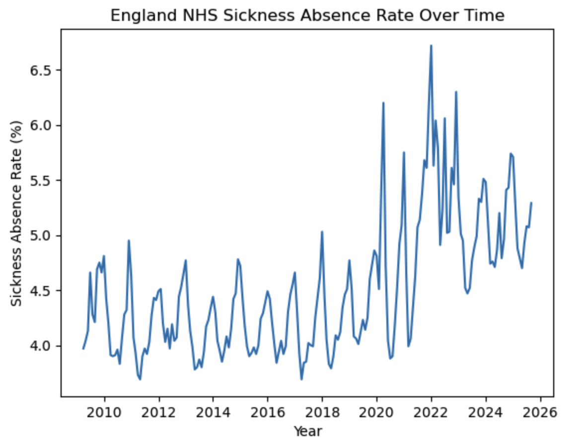
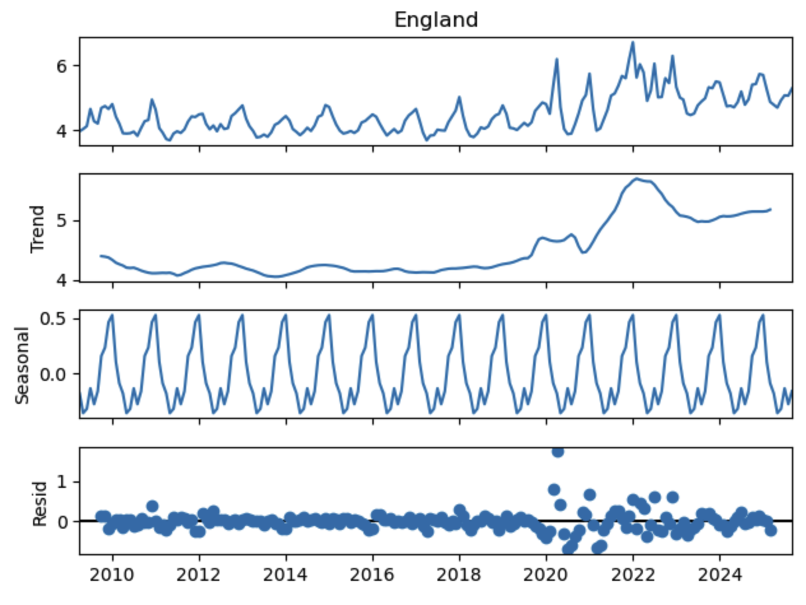
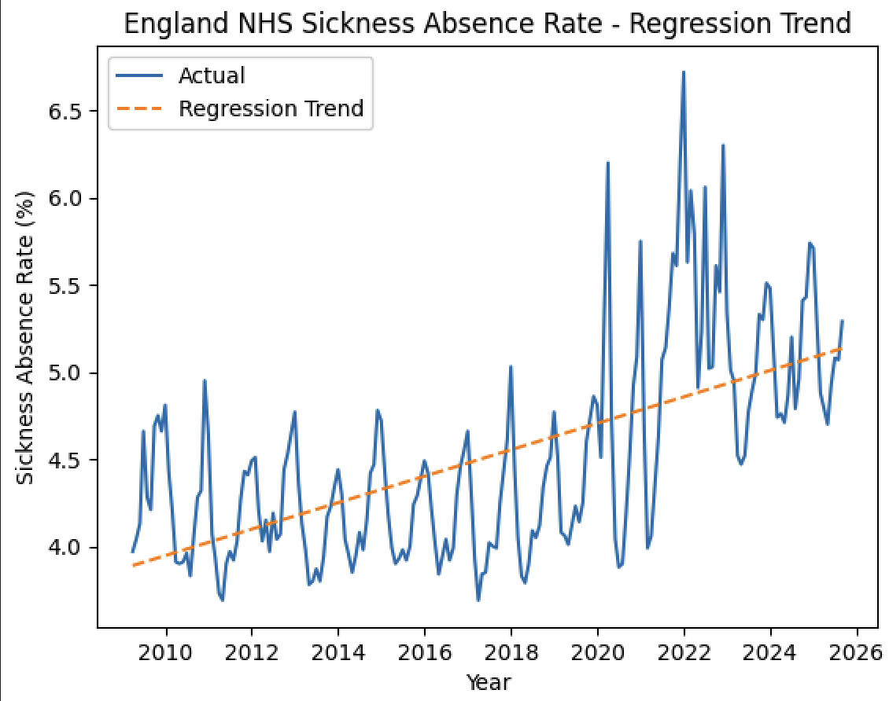

Figure A : **NHS Absence Rates Over Time.**

Figure B : **NHS Absence Rates Over Trend-Seasonal-Residue.**

Figure C : **NHS Absence Rates Regression.**

Figure D : **NHS Absence Rates Forecast.**

